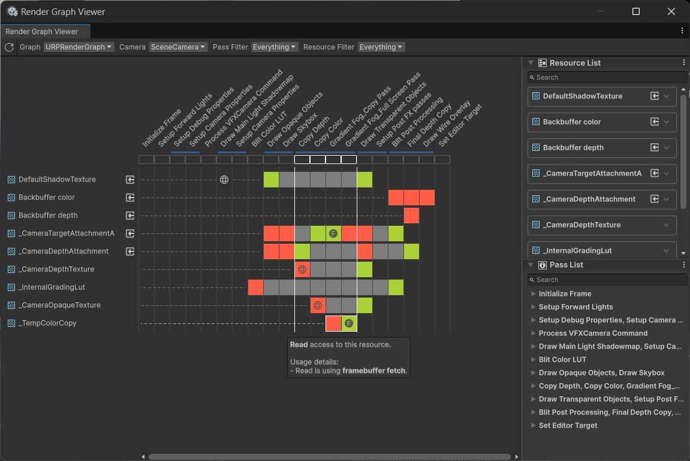

# GradientFog (WIP)
This is an updated version of the GradientFog RenderFeature based [UniversalRenderingExamples GradientFog](https://github.com/Unity-Technologies/UniversalRenderingExamples/wiki/Gradient-Fog) from 2020.

# Overview
The GradientFog RenderFeature is a post-processing effect that can be injected into different parts of the Render Pipeline. By default it is set to "Before Rendering Transparents" so it affects the Skybox as well. It provides a start and end distances with 3 colors to control the fog effect applied to the color buffer based on the depth information.

# What was updated
The RenderFeature was updated to support Unity 6 and RenderGraph only. I also added FrameBufferFetch which means the render pass can access the framebuffer from the on-chip memory of the GPU, instead of video memory. This speeds up rendering, because the GPU doesn’t need to copy the texture to and from its video memory. Essentially, using FrameBufferFetch reduces memory bandwidth usage, which can improve performance if bandwidth bound, and generally reduce battery usage.

Another example can be found in Unity's [URP for advanced creators e-book](https://unity.com/resources/introduction-to-urp-advanced-creators-unity-6).

The Universal Render Pipeline (URP) merges the render passes that write to the framebuffer and read from it as seen in the image below:

FrameBufferFetch is denoted by the **F** inside the square and when hovering over the render passes, a block is shown to illustrate that these are now merged passes. Unity specifically tells you that a **Native Pass was created by merging 4 Raster Render Passes**.

Looking more at the Gradient Fog RenderFeature in RenderGraph, you can see there is a **Copy Depth**, **Copy Color**, **Gradient Fog_Copy Pass**, and a **Gradient Fog_Full Screen Pass**. Essentially, the RenderFeature copies the current Color from the screen (Copy Pass) an intermediate texture, which is then used by the Full Screen Pass that uses both the Color and Depth to create the Gradient Fog effect. You can also see that since I set the injection point to Before Rendering Transparents, this occurs after the Skybox is drawn.

# Limitations/Issues
- I have some experience with RenderFeatures, but I'm new to RenderGraph so likely there are issues with the current implementation.
- Requires use of the **Depth Texture** which can result in increased memory bandwidth usage and longer rendering times.
- It does **NOT** work in compatibility mode. I haven't added support for compatibility mode so if RenderGraph is disabled in the GraphicsSettings, the effect won't work and a warning will be provided.
- FramebufferFetch support is **only available** on platforms targeting Graphics APIs such as Vulkan, Metal, and DirectX 12.
